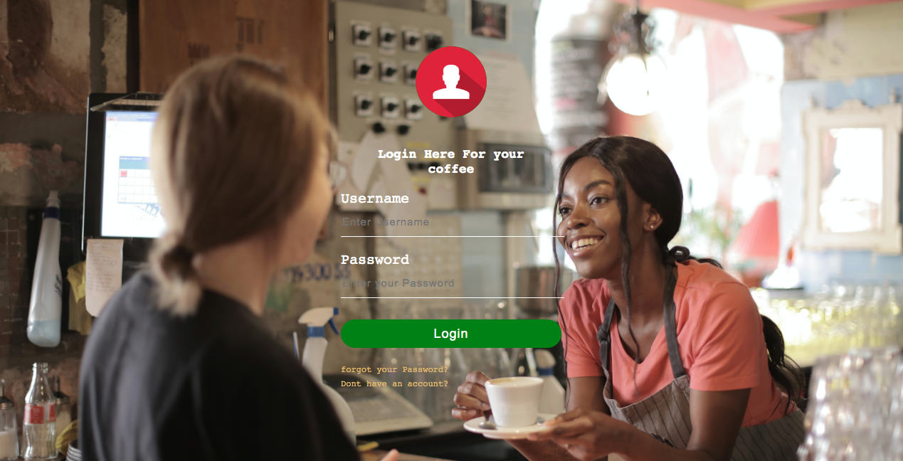
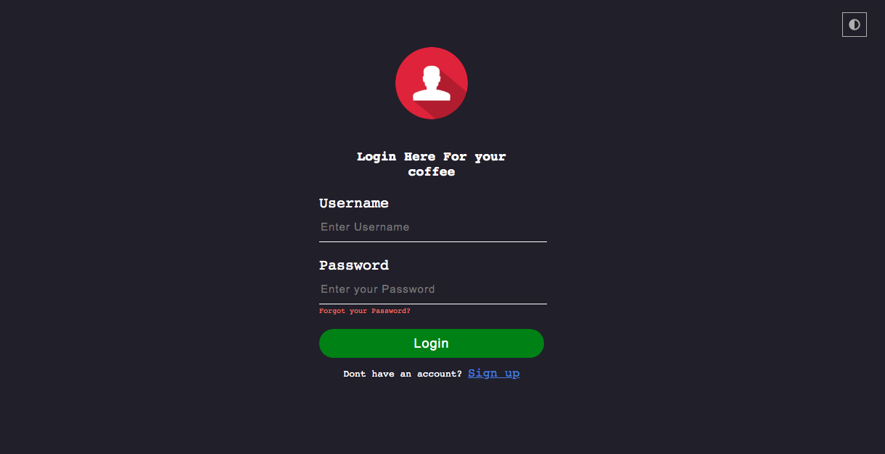

# Login Coffee Shop



## links

[Live](https://brymmobaggins.github.io/LoginCoffeeShop/)

## Built with

- HTML
- CSS
- Vanilla JavaScript

## Continue developement

I came up with an idea, which is dark and light UI theme with a toggle button to be more attractive for users. It was tricky all along, which changes the font colors and background on whenever the toggle button is clicked

```JavaScript
let body = document.body;
let toggleBtn = document.querySelector(".toggle-btn");
let currentTheme = localStorage.getItem("currentTheme");

if (currentTheme) {
  body.classList.add("dark-theme");
}
toggleBtn.addEventListener("click", function () {
  body.classList.toggle("dark-theme");

  if (body.classList.contains("dark-theme")) {
    localStorage.setItem("currentTheme", "themeActive");
  } else {
    localStorage.removeItem("currentTheme");
  }
});
```

## Screenshot



## Useful Resources

- [Pexel](Pexels.com)
- [Google-font](GoogleFonts.com)
